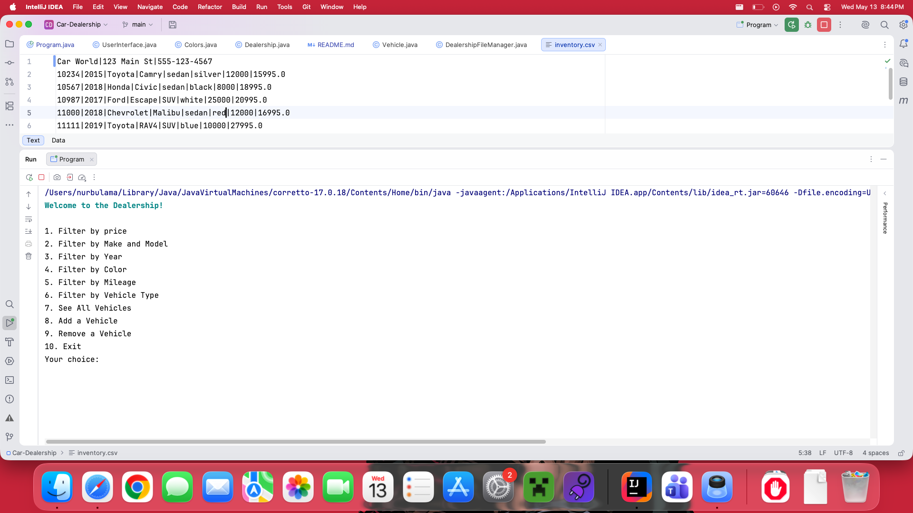
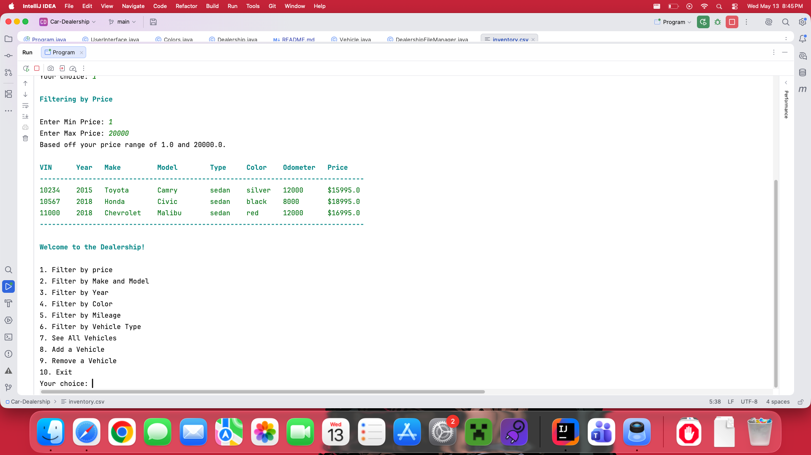
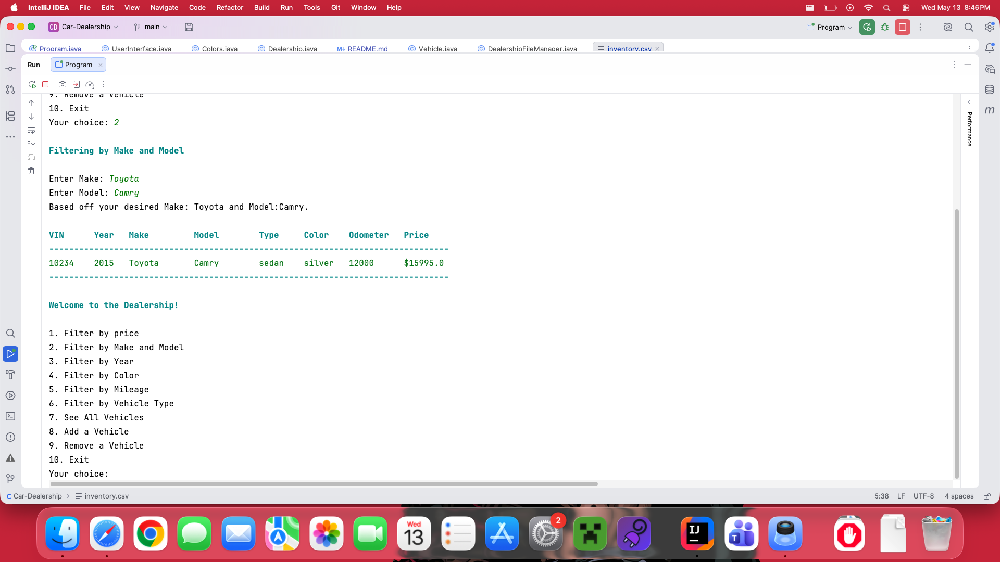
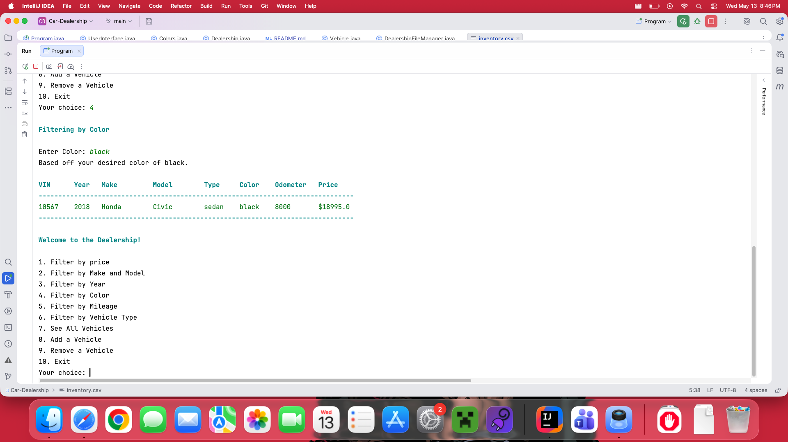
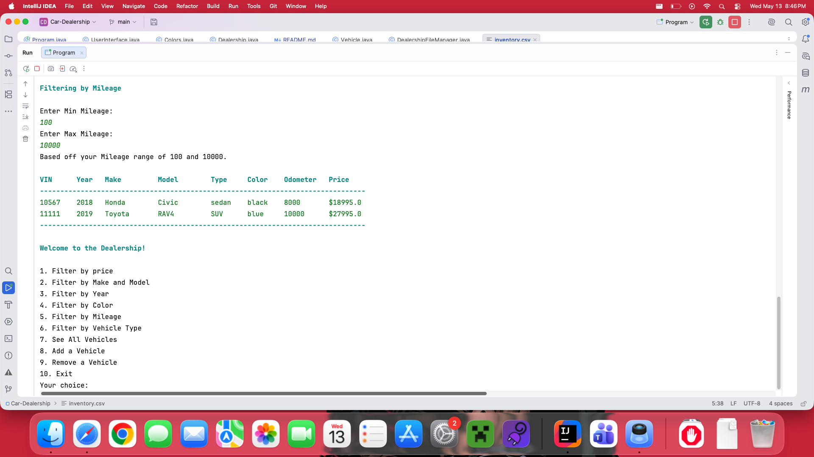
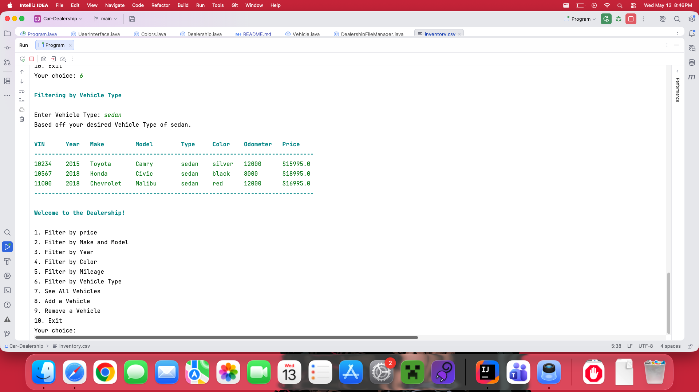
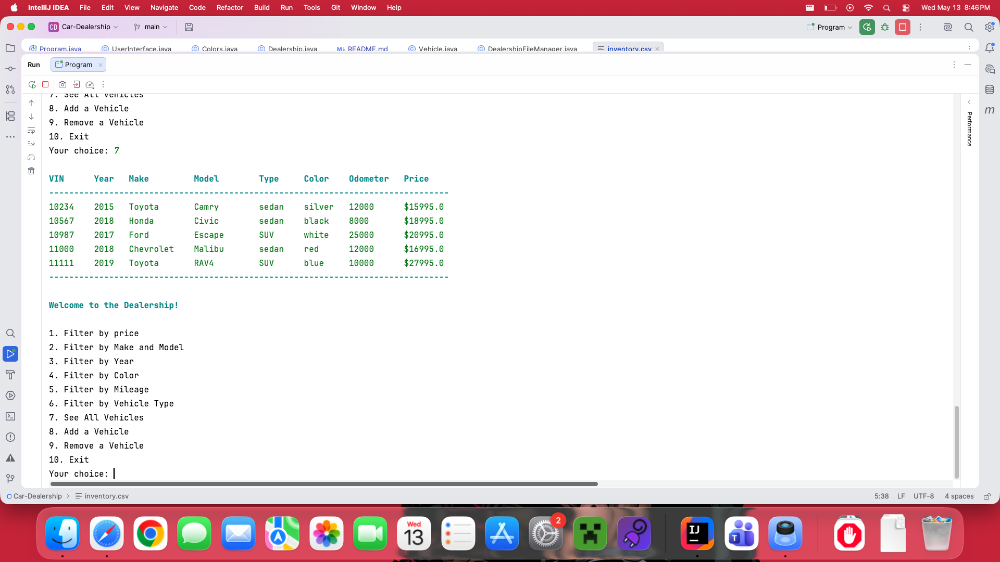
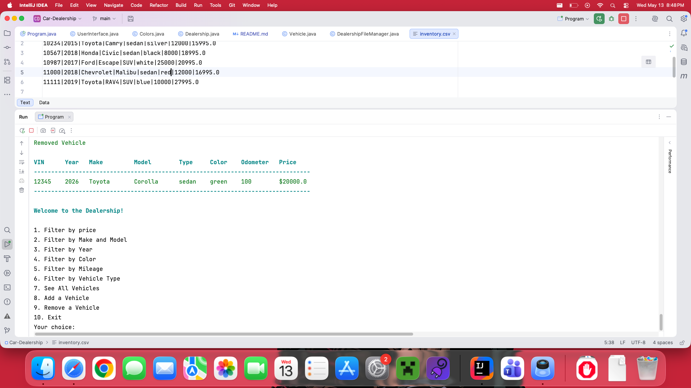
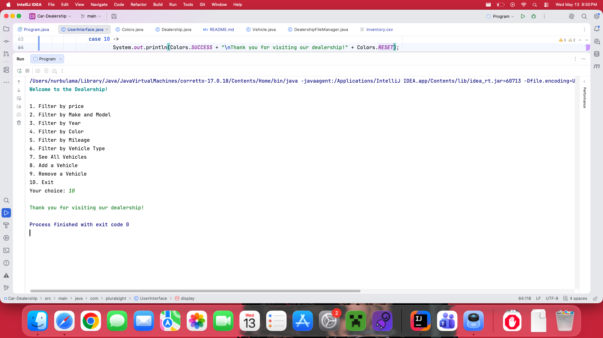

# Car Dealership

## Description of the Project

This is a simple Java CLI application that manages a car dealership's vehicle inventory.
It is able to load data from "inventory.csv" into our dealership object, so we can have
all the information about a dealership such as it's name, address and all the vehicles within
it's stock.

The users for this application would be customers and dealership staff, who need quick and easy access to
the inventory data. Which they would be able to easily do with the included filters that can be applied. Also,
if staff needs to update inventory after a car is sold or a new car comes into the inventory, they would easily
be able to stay updated to give customers the most recent information.

## User Stories

- As a customer, I want every vehicle to their own unique information, so I can find the specific one I'm looking for.
- As a customer, I want to know what dealership I'm in, So I know which dealership the car I want is in.
- As a customer, I want to be able to search for cars by a price range, so I can see which cars fit within my budget.
- As a customer, I want to be able to search for cars by year range, so I can see cars from the years I
  prefer.
- As a customer, I want to be able to search for cars by make and model, so I can see which cars fit within my
  preference.
- As a customer, I want to be able to search for cars by a color, so I can see cars that fit my personal preference.
- As a customer, I want to be able to search for cars by a mileage range, so I can see which cars are not brand new or
  how used.
- As a customer, I want to be able to search for cars by a type, so I can see which cars fit my personal preference.
- As a customer, I want the option of seeing all the cars in the inventory, so I can quickly look through the cars in
  the dealership.
- As the dealership, I want to be able to add new cars that arrive into my inventory list, so our customers can stay
  updated on our selections.
- As the dealership, I want to be able to remove cars from my inventory list, so our customers can stay updated on our
  selections.
- Task: Load vehicles information into Inventory ArrayList for each dealership.
- Reuse helper functions parseDouble and create parseInt to handle any errors with inventory inputs.

## Setup

Instructions on how to set up and run the project using IntelliJ IDEA.

### Prerequisites

- IntelliJ IDEA: Ensure you have IntelliJ IDEA installed, which you can download
  from [here](https://www.jetbrains.com/idea/download/).
- Java SDK: Make sure Java SDK is installed and configured in IntelliJ.

### Running the Application in IntelliJ

Follow these steps to get your application running within IntelliJ IDEA:

1. Open IntelliJ IDEA.
2. Select "Open" and navigate to the directory where you cloned or downloaded the project.
3. After the project opens, wait for IntelliJ to index the files and set up the project.
4. Find the main class with the `public static void main(String[] args)` method.
5. Right-click on the file and select 'Run 'YourMainClassName.main()'' to start the application.

## Technologies Used

- Java: Mention the version you are using.
- Any additional libraries or frameworks used in the project.

## Demo

Include screenshots or GIFs that show your application in action. Use tools
like [Giphy Capture](https://giphy.com/apps/giphycapture) to record a GIF of your application.

Main Menu

Filtering by Price

Filtering by Make and Model

Filtering by Year

Filtering by Color

Filtering by Mileage

Filtering by vehicle Type

See All vehicles within Dealership

Add a Vehicle

Remove a Vehicle

Closing Statement

## Future Work

Outline potential future enhancements or functionalities you might consider adding:

- I would love to build out a GUI.
- Have better detailing on colors.

## Resources

List resources such as tutorials, articles, or documentation that helped you during the project.

- [Java Programming Tutorial](https://www.example.com)
- [Effective Java](https://www.example.com)
- https://www.geeksforgeeks.org/java/how-to-print-colored-text-in-java-console/

## Thanks

Express gratitude towards those who provided help, guidance, or resources:

- Thank you to [Raymond] for continuous support and guidance.
- A special thanks to all teammates for their dedication and teamwork.
 